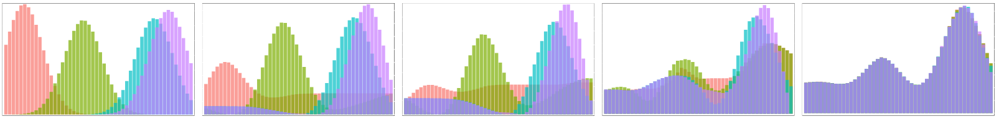

# Efficient Computation of d-Dimensional Earth Mover's Distance


Poke around the visualizations folder, and here in the root for some fun basics.
For a high-level overview in a more digestible format, checkout my blog post: [Incorporating Preferences is Easy if you Discretize](https://ronakrm.github.io/discretized-preferences-are-easy/).

`ICLR23_Experiments` contains the implementation and experiments for ICLR 2023: Efficient Discrete Multi Marginal Optimal Transport Regularization.


## Reference
Efficient Discrete Multi Marginal Optimal Transport Regularization.  
Ronak Mehta, Jeffery Kline, Vishnu Suresh Lokhande, Glenn Fung, Vikas Singh.  
ICLR 2023, Spotlight.  
[https://openreview.net/forum?id=R98ZfMt-jE](https://openreview.net/forum?id=R98ZfMt-jE)

```
@inproceedings{
mehta2023efficient,
title={Efficient Discrete Multi Marginal Optimal Transport Regularization},
author={Ronak Mehta and Jeffery Kline and Vishnu Suresh Lokhande and Glenn Fung and Vikas Singh},
booktitle={International Conference on Learning Representations},
year={2023},
url={https://openreview.net/forum?id=R98ZfMt-jE}
}
```
